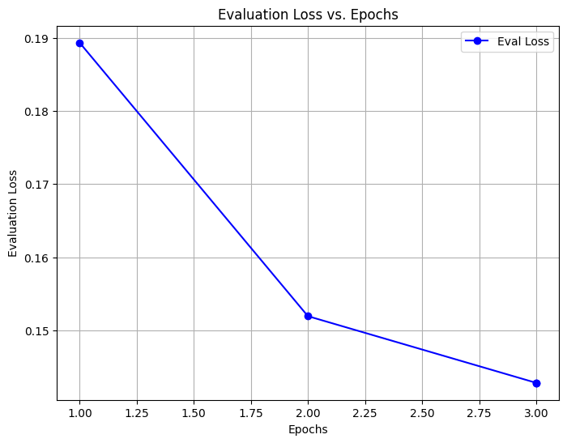
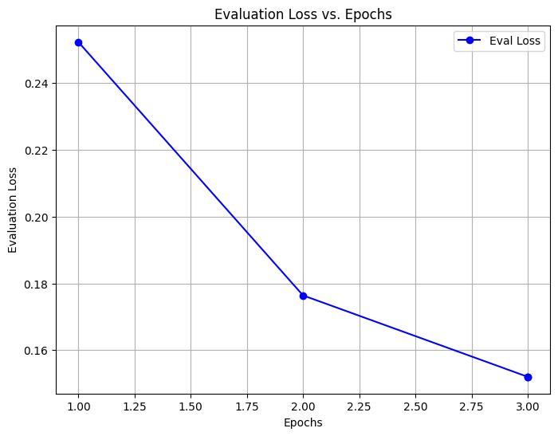
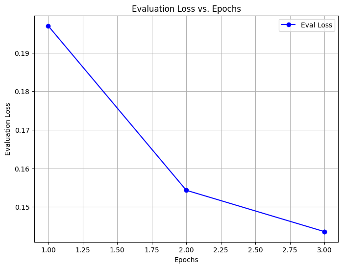
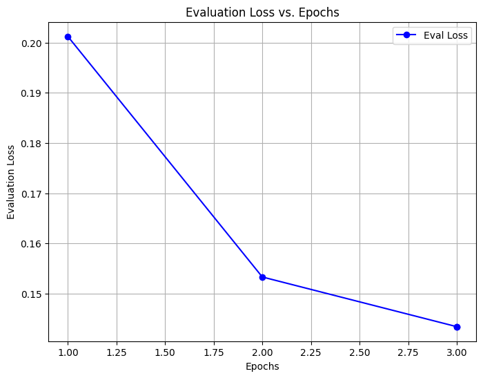

# Named Entity Recognition Model for Drone Forensics
This document provides a comprehensive overview of the research and development process for creating a Named Entity Recognition (NER) model tailored to drone forensic analysis. The objective is to address challenges such as the classification of polysemous words in drone log messages, enhancing the model's accuracy and contextual understanding.

Building upon prior work, this effort utilizes advanced techniques like Part of Speech (POS) tagging and transformer-based models, including ALBERT and RoBERTa. This document outlines the methodologies, datasets, implementation steps, and results observed during the project. Additionally, insights into the workflow, such as annotation processes, data preprocessing, and model fine-tuning, are discussed.

## Previous Work
Our Research work is based on the previous work in **Swardiantra Silalahi**'s research paper [**Named Entity Recoginition**](https://scholar.its.ac.id/en/publications/named-entity-recognition-for-drone-forensic-using-bert-and-distil) that was based on BERT and DistillBert, but the major problem was the prediction capabilities of model and the problems related to polysemous words.

## Advancements in Our Approach
Building upon the foundation of prior research, this work addresses key limitations observed in earlier models, including challenges with polysemous words and prediction accuracy. Our contributions focus on enhancing contextual understanding through the incorporation of advanced techniques such as Part of Speech (POS) tagging and leveraging transformer-based architectures, ALBERT and RoBERTa.
>Enhancement of Dataset  

The original dataset was too small to work on any deep-learning transformer model, working as the key bottleneck in the research regarding the NER based tagging model's developement.  
Log Messages were taken from Air-Data repository and were manually tagged down to their corresponding IOB2 tags.  
Use this python script to automate the process of the Text-Annotation.

The words first extraced from the log message written down in a csv file along with their sentence id, then manual annotation process begin.
```python
def annotationFiller(nonCapWord, capAnnot, nonCapAnnot):
    capWord = "".join([char.upper() if i == 0 else char for i, char in enumerate(nonCapWord)])
    words_to_write = []
    if df["words"][df["words"] == capWord].any():
        df.loc[df["words"] == capWord, "labels"] = str(capAnnot)
    else: print(capWord + " not found in the dataset")
    with open("to_looked.txt", "r") as to_looked:
        words_to_read = to_looked.readlines()
        words = [word.strip() for word in words_to_read if word.strip() != capWord]
        words_to_write.extend(words)
    with open("to_looked.txt", "w") as to_looked:
        to_looked.writelines(word + "\n" for word in words_to_write)

    words_to_write = []
    if df["words"][df["words"] == nonCapWord].any():
        df.loc[df["words"] == nonCapWord, "labels"] = str(nonCapAnnot)
    else: print(nonCapWord + " not found in the dataset")
    with open("to_looked.txt", "r") as to_looked:
        words_to_read = to_looked.readlines()
        words = [word.strip() for word in words_to_read if word.strip() != nonCapWord]
        words_to_write.extend(words)
    with open("to_looked.txt", "w") as to_looked:
        to_looked.writelines(word + "\n" for word in words_to_write)
    
    df.to_csv("combined_tokenized_research_dataset.csv", index = False)
    print("Next Word to annot: " + words_to_write[0])
```
Working is based on the approach as follow:  

* Load the Dataset's CSV file.
* Store all the distinct word of the csv in to the Text-file. 
* Word is assumed to be in non-capital first. The annotation of the word when it is capitalized and when not is passed to the function to speedup the pace of the work. Let an example:-  
  * Data is the word and it's annotation when it's not capitalized is I-XXX and when it's capitalized is B-XXX; then we'll use this function as follow: 
    * Data in non capital form -> "data"
    * annotation for -> "data": a1
    * annotation for -> "Data": a2
    ```python
    annotationFiller("data", a1, a2)
      ```
* Then finally encode the label or annotations to integers fitting into the model.  
The final dimension of the dataset: **58981 * 4**  
Total distinct words in dataset: **1131**  
Total distinct Annotations corresponding to words: **44**
>Key Innovations in Workflow

* Structured manual annotation to label unique terms with precision.

* Tokenization, capitalization, and ordering layers to streamline data preprocessing.
  
* Transformer-based approaches utilizing various models from BERT family to mitigate overfitting and enhance prediction accuracy.
* The major improvement is made using Roberta model.

>Model Training and More Further

For the purpose of the training all models built were pretrained models from BERT family, we have used the 5 best ones:  
* BERT
* Distil Bert
* Roberta
* Albert
* Deberta
  
>>Process of traning the models:
    
Training of all transformer include the same steps. For example we would use Roberta BERT transformer on all the code examples.

* Defining the class of the Transformer first to initiate the object:
```python
## import according to your model
from transformers import RobertaTokenizer, RobertaForSequenceClassification, TrainingArguments, Trainer
# from transformers import BertTokenizer, BertForSequenceClassification
# from transformers import DebertaTokenizer, DebertaForSequenceClassification
# from transformers import DistilBertTokenizer, DistilBertForSequenceClassification

from datasets import Dataset
from sklearn.metrics import accuracy_score, f1_score, classification_report, precision_score, recall_score
import numpy as np
import pandas as pd
import matplotlib.pyplot as plt

class RobertaModel:
    def __init__(self):
        self.tokenizer = RobertaTokenizer.from_pretrained('roberta-large')

    def dataset_setting(self, dataset_text_att, dataset_label_att):
        text = dataset_text_att.tolist()
        labels = dataset_label_att.tolist()
        data = {"text": text, "labels": labels}
        dataset = Dataset.from_dict(data)
        dataset = dataset.train_test_split(test_size=0.33, seed = 1)
        return dataset

    def tokenize_function(self, examples):
        return self.tokenizer(examples['text'], padding='max_length', truncation=True)

    def mapping(self, dataset):
        tokenized_dataset = dataset.map(self.tokenize_function, batched=True)
        return tokenized_dataset

    def setting_format(self, columns, tokenized_dataset):
        tokenized_dataset.set_format(type='torch', columns=columns)
        return tokenized_dataset

    def init_model(self, num_labels=2):
        model = RobertaForSequenceClassification.from_pretrained('roberta-large', num_labels=num_labels)
        return model

    def training_args(self, output_dir, evaluation_strategy, learning_rate,
                      per_device_train_batch_size, per_device_eval_batch_size,
                      num_train_epochs, weight_decay):
        training_args = TrainingArguments(
            output_dir=output_dir,
            evaluation_strategy=evaluation_strategy,
            learning_rate=learning_rate,
            per_device_train_batch_size=per_device_train_batch_size,
            per_device_eval_batch_size=per_device_eval_batch_size,
            num_train_epochs=num_train_epochs,
            weight_decay=weight_decay,
            save_steps = 0,
            save_strategy = "epoch"
        )
        return training_args

    def compute_metrics(self, eval_pred):
        logits, labels = eval_pred
        predictions = np.argmax(logits, axis=1)
        accuracy = accuracy_score(labels, predictions)
        precision = precision_score(labels, predictions, average='weighted')
        recall = recall_score(labels, predictions, average='weighted')
        f1 = f1_score(labels, predictions, average='weighted')
        return {"accuracy": accuracy,"precision": precision, "recall": recall, "f1": f1}

    def trainer_setup(self, model, training_args, train_dataset, eval_dataset):
        trainer = Trainer(
            model=model,
            args=training_args,
            train_dataset=train_dataset,
            eval_dataset=eval_dataset,
            tokenizer=self.tokenizer,
            compute_metrics=self.compute_metrics
        )
        return trainer

    def train(self, trainer):
        print("Training has been initiated")
        trainer.train()
        print("Training Completed")

    def result(self, trainer):
        print(trainer.evaluate())

    def classification_report(self, trainer, eval_dataset):
        # Make predictions
        predictions = trainer.predict(eval_dataset)
        logits, labels = predictions.predictions, predictions.label_ids

        # Get the predicted classes
        preds = np.argmax(logits, axis=1)

        # Generate the classification report
        report = classification_report(labels, preds, target_names=['B-PARAMETER PROPN', 'B-COMPONENT NOUN', 'O NOUN', 'O AUX', 'O X',
       'O PUNCT', 'O VERB', 'O ADV', 'O ADJ', 'O ADP', 'O NUM',
       'B-PARAMETER NOUN', 'B-ACTION VERB', 'O SCONJ', 'O PRON',
       'B-STATE NOUN', 'B-FUNCTION VERB', 'B-ISSUE VERB', 'O PART',
       'B-COMPONENT ADJ', 'I-ACTION VERB', 'B-FUNCTION NOUN',
       'B-ACTION NOUN', 'O INTJ', 'B-ISSUE NOUN', 'I-STATE VERB',
       'O PROPN', 'I-ACTION ADP', 'B-STATE PROPN', 'B-ACTION PROPN',
       'B-STATE ADJ', 'O', 'I-STATE NOUN', 'B-ISSUE PROPN',
       'B-PARAMETER ADJ', 'B-FUNCTION ADJ', 'B-ISSUE ADJ',
       'I-COMPONENT NOUN', 'B-STATE ADV', 'B-COMPONENT VERB',
       'I-FUNCTION VERB', 'B-STATE VERB', 'I-ACTION NOUN',
       'I-PARAMETER NOUN'])
        return report
# Dataset setup
roberta = RobertaModel()

# Split dataset into train and test
dataset = roberta.dataset_setting(df['words'], df['labels_encoded2'])

# Map tokenization function
tokenized_dataset = roberta.mapping(dataset)

# Tokenize each split separately
from imblearn.over_sampling import RandomOverSampler
from imblearn.under_sampling import RandomUnderSampler
from datasets import Dataset, DatasetDict
import pandas as pd
import numpy as np

from imblearn.over_sampling import RandomOverSampler
# Step 1: Extract Training Data
train_df = tokenized_dataset['train'].to_pandas()

# Step 2: Apply Oversampling
ros = RandomOverSampler(random_state=42, sampling_strategy="minority")
x_resampled, y_resampled = ros.fit_resample(
    np.array(train_df['text']).reshape(-1, 1),
    train_df['labels']
)

# Convert to pandas DataFrame
oversampled_train_df = pd.DataFrame({
    "text": x_resampled.ravel(),
    "labels": y_resampled
})

# also Undersampling
rus = RandomUnderSampler(random_state=42, sampling_strategy="majority")
x_resampled, y_resampled = ros.fit_resample(
    np.array(train_df['text']).reshape(-1, 1),
    train_df['labels']
)

# Converting to pandas DataFrame
oversampled_undersampled_train_df = pd.DataFrame({
    "text": x_resampled.ravel(),
    "labels": y_resampled
})
# Step 3: Convert Back to Dataset
train_dataset = Dataset.from_pandas(oversampled_undersampled_train_df)  # oversampled_train_df -> train_df

# Step 4: Replace Training Split in DatasetDict
tokenized_dataset = DatasetDict({
    "train": train_dataset,
    "test": dataset['test']
})

# Step 5: Tokenize the Dataset
tokenized_dataset = tokenized_dataset.map(roberta.tokenize_function, batched=True)

# Explicitly select 'train' and 'test' splits for further processing

# Format tokenized datasets
formatted_train = roberta.setting_format(['input_ids', 'attention_mask', 'labels'], tokenized_dataset['train'])
formatted_test = roberta.setting_format(['input_ids', 'attention_mask', 'labels'], tokenized_dataset['test'])

# Initialize model
model = roberta.init_model(num_labels=44)
model.to("cuda")

# Define training arguments
training_args = roberta.training_args(
    output_dir='./results',
    evaluation_strategy='epoch',
    learning_rate=2e-5,
    per_device_train_batch_size=8,
    per_device_eval_batch_size=8,
    num_train_epochs=3,
    weight_decay=0.01,
)

# Setup trainer
trainer = roberta.trainer_setup(
    model=model,
    training_args=training_args,
    train_dataset=formatted_train,
    eval_dataset=formatted_test
)

# Train the model
roberta.train(trainer)

# Evaluate and generate classification report
roberta.result(trainer)
report = roberta.classification_report(trainer, formatted_train)
print(report)

def plot_eval_loss(trainer):
    logs = trainer.state.log_history
    eval_losses = [log['eval_loss'] for log in logs if 'eval_loss' in log]
    epochs = [log['epoch'] for log in logs if 'eval_loss' in log]
    
    plt.figure(figsize=(8, 6))
    plt.plot(epochs, eval_losses, marker='o', linestyle='-', color='b', label='Eval Loss')
    plt.xlabel('Epochs')
    plt.ylabel('Evaluation Loss')
    plt.title('Evaluation Loss vs. Epochs')
    plt.grid(True)
    plt.legend()
    plt.show()

plot_eval_loss(trainer)
```
>>Results of Training

The results corresponding to each model are as follows:
### Roberta
RoBERTa (Robustly Optimized BERT Pretraining Approach) is an enhanced version of BERT, designed to maximize performance by refining the pretraining process. Unlike BERT, it eliminates the Next Sentence Prediction (NSP) task, employs dynamic masking techniques, and trains on larger datasets for longer durations. This results in improved contextual understanding and generalization, making it ideal for tasks requiring nuanced comprehension, such as disambiguating polysemous words in drone log messages.

**Training Table**
| Epoch | Training Loss | Validation Loss | Accuracy  | Precision | Recall    | F1       |
|-------|---------------|-----------------|-----------|-----------|-----------|----------|
| 1     | 0.191000      | 0.189377        | 0.919544  | 0.919259  | 0.919544  | 0.914362 |
| 2     | 0.129200      | 0.151917        | 0.927250  | 0.932714  | 0.927250  | 0.926294 |
| 3     | 0.123300      | 0.142783        | 0.927456  | 0.933115  | 0.927456  | 0.926795 |

**Classification Report**
| Class                   | Precision | Recall | F1-Score | Support |
|-------------------------|-----------|--------|----------|---------|
| B-PARAMETER PROPN       | 1.00      | 1.00   | 1.00     | 484     |
| B-COMPONENT NOUN        | 1.00      | 1.00   | 1.00     | 55      |
| O NOUN                 | 1.00      | 1.00   | 1.00     | 1236    |
| O AUX                  | 1.00      | 1.00   | 1.00     | 150     |
| O X                    | 1.00      | 1.00   | 1.00     | 2304    |
| O PUNCT                | 1.00      | 1.00   | 1.00     | 41      |
| O VERB                 | 1.00      | 1.00   | 1.00     | 34      |
| O ADV                  | 1.00      | 1.00   | 1.00     | 387     |
| O ADJ                  | 1.00      | 1.00   | 1.00     | 33      |
| O ADP                  | 1.00      | 0.99   | 1.00     | 106     |
| O NUM                  | 1.00      | 1.00   | 1.00     | 633     |
| B-PARAMETER NOUN       | 1.00      | 0.93   | 0.96     | 42      |
| B-ACTION VERB          | 1.00      | 1.00   | 1.00     | 189     |
| O SCONJ                | 1.00      | 1.00   | 1.00     | 30      |
| O PRON                 | 1.00      | 1.00   | 1.00     | 1232    |
| B-STATE NOUN           | 1.00      | 1.00   | 1.00     | 350     |
| B-FUNCTION VERB        | 1.00      | 1.00   | 1.00     | 486     |
| B-ISSUE VERB           | 0.97      | 1.00   | 0.99     | 39      |
| O PART                 | 0.99      | 1.00   | 1.00     | 483     |
| B-COMPONENT ADJ        | 1.00      | 1.00   | 1.00     | 322     |
| I-ACTION VERB          | 1.00      | 1.00   | 1.00     | 109     |
| B-FUNCTION NOUN        | 1.00      | 1.00   | 1.00     | 136     |
| B-ACTION NOUN          | 1.00      | 1.00   | 1.00     | 7611    |
| O INTJ                 | 1.00      | 1.00   | 1.00     | 1483    |
| B-ISSUE NOUN           | 1.00      | 1.00   | 1.00     | 235     |
| I-STATE VERB           | 1.00      | 1.00   | 1.00     | 34      |
| O PROPN                | 1.00      | 1.00   | 1.00     | 42      |
| I-ACTION ADP           | 1.00      | 1.00   | 1.00     | 84      |
| B-STATE PROPN          | 1.00      | 1.00   | 1.00     | 337     |
| B-ACTION PROPN         | 1.00      | 0.95   | 0.98     | 108     |
| B-STATE ADJ            | 1.00      | 1.00   | 1.00     | 1925    |
| O                      | 1.00      | 1.00   | 1.00     | 3004    |
| I-STATE NOUN           | 1.00      | 1.00   | 1.00     | 1699    |
| B-ISSUE PROPN          | 1.00      | 1.00   | 1.00     | 1511    |
| B-PARAMETER ADJ        | 1.00      | 1.00   | 1.00     | 226     |
| B-FUNCTION ADJ         | 1.00      | 1.00   | 1.00     | 6524    |
| B-ISSUE ADJ            | 1.00      | 1.00   | 1.00     | 1115    |
| I-COMPONENT NOUN       | 1.00      | 1.00   | 1.00     | 451     |
| B-STATE ADV            | 1.00      | 1.00   | 1.00     | 1116    |
| B-COMPONENT VERB       | 1.00      | 1.00   | 1.00     | 117     |
| I-FUNCTION VERB        | 1.00      | 1.00   | 1.00     | 7611    |
| B-STATE VERB           | 1.00      | 1.00   | 1.00     | 837     |
| I-ACTION NOUN          | 1.00      | 1.00   | 1.00     | 1505    |
| I-PARAMETER NOUN       | 1.00      | 1.00   | 1.00     | 647     |
| **Accuracy**           |           |        | 1.00     | 47103   |
| **Macro Avg**          | 1.00      | 1.00   | 1.00     | 47103   |
| **Weighted Avg**       | 1.00      | 1.00   | 1.00     | 47103   |




### ALBERT
ALBERT (A Lite BERT) is a lightweight variant of BERT, designed for efficiency and scalability. It reduces the model size through parameter sharing and embedding matrix factorization without compromising performance. ALBERT is particularly effective in scenarios where computational resources are limited but high accuracy is still needed, such as in processing large-scale drone log data.  
**Training Table**
| Epoch | Training Loss | Validation Loss | Accuracy  | Precision | Recall    | F1        |
|-------|---------------|-----------------|-----------|-----------|-----------|-----------|
| 1     | 0.364200      | 0.252288        | 0.903720  | 0.901421  | 0.903720  | 0.898189  |
| 2     | 0.160600      | 0.176418        | 0.921958  | 0.926822  | 0.921958  | 0.920276  |
| 3     | 0.129200      | 0.152043        | 0.926737  | 0.929779  | 0.926737  | 0.926025  |

**Classification Report**
| Class                  | Precision | Recall | F1-Score | Support |
|------------------------|-----------|--------|----------|---------|
| B-PARAMETER PROPN      | 0.55      | 0.73   | 0.63     | 484     |
| B-COMPONENT NOUN       | 0.92      | 1.00   | 0.96     | 55      |
| O NOUN                | 0.77      | 0.86   | 0.81     | 1236    |
| O AUX                 | 0.83      | 1.00   | 0.91     | 150     |
| O X                   | 0.82      | 0.85   | 0.84     | 2304    |
| O PUNCT               | 0.00      | 0.00   | 0.00     | 41      |
| O VERB                | 1.00      | 1.00   | 1.00     | 34      |
| O ADV                 | 0.99      | 1.00   | 1.00     | 387     |
| O ADJ                 | 1.00      | 1.00   | 1.00     | 33      |
| O ADP                 | 0.99      | 0.99   | 0.99     | 106     |
| O NUM                 | 0.72      | 0.99   | 0.84     | 633     |
| B-PARAMETER NOUN      | 0.74      | 0.69   | 0.72     | 42      |
| B-ACTION VERB         | 0.69      | 0.87   | 0.77     | 189     |
| O SCONJ               | 1.00      | 0.97   | 0.98     | 30      |
| O PRON                | 0.93      | 0.62   | 0.74     | 1232    |
| B-STATE NOUN          | 1.00      | 0.86   | 0.92     | 350     |
| B-FUNCTION VERB       | 0.99      | 0.99   | 0.99     | 486     |
| B-ISSUE VERB          | 1.00      | 0.97   | 0.99     | 39      |
| O PART                | 0.95      | 1.00   | 0.98     | 483     |
| B-COMPONENT ADJ       | 1.00      | 1.00   | 1.00     | 322     |
| I-ACTION VERB         | 1.00      | 0.98   | 0.99     | 109     |
| B-FUNCTION NOUN       | 0.96      | 0.82   | 0.89     | 136     |
| B-ACTION NOUN         | 1.00      | 1.00   | 1.00     | 7611    |
| O INTJ                | 1.00      | 1.00   | 1.00     | 1483    |
| B-ISSUE NOUN          | 0.97      | 0.99   | 0.98     | 235     |
| I-STATE VERB          | 1.00      | 1.00   | 1.00     | 34      |
| O PROPN               | 1.00      | 0.88   | 0.94     | 42      |
| I-ACTION ADP          | 0.96      | 0.98   | 0.97     | 84      |
| B-STATE PROPN         | 1.00      | 0.97   | 0.98     | 337     |
| B-ACTION PROPN        | 0.94      | 0.95   | 0.94     | 108     |
| B-STATE ADJ           | 1.00      | 0.98   | 0.99     | 1925    |
| O                     | 1.00      | 1.00   | 1.00     | 3004    |
| I-STATE NOUN          | 1.00      | 1.00   | 1.00     | 1699    |
| B-ISSUE PROPN         | 1.00      | 1.00   | 1.00     | 1511    |
| B-PARAMETER ADJ       | 1.00      | 1.00   | 1.00     | 226     |
| B-FUNCTION ADJ        | 0.85      | 0.84   | 0.85     | 6524    |
| B-ISSUE ADJ           | 1.00      | 1.00   | 1.00     | 1115    |
| I-COMPONENT NOUN      | 1.00      | 1.00   | 1.00     | 451     |
| B-STATE ADV           | 1.00      | 1.00   | 1.00     | 1116    |
| B-COMPONENT VERB      | 1.00      | 0.78   | 0.88     | 117     |
| I-FUNCTION VERB       | 1.00      | 1.00   | 1.00     | 7611    |
| B-STATE VERB          | 1.00      | 1.00   | 1.00     | 837     |
| I-ACTION NOUN         | 0.83      | 0.75   | 0.79     | 1505    |
| I-PARAMETER NOUN      | 1.00      | 1.00   | 1.00     | 647     |
| **Accuracy**          |           |        | 0.94     | 47103   |
| **Macro Avg**         | 0.92      | 0.92   | 0.91     | 47103   |
| **Weighted Avg**      | 0.94      | 0.94   | 0.94     | 47103   |




### DeBERTa
DeBERTa (Decoding-enhanced BERT with Disentangled Attention) extends BERT by introducing disentangled attention mechanisms and an improved positional encoding. This allows DeBERTa to better understand the relative importance of words in a sequence, enhancing its ability to resolve ambiguities and improve the prediction accuracy in drone log message analysis.

**Training Table**
| Epoch | Training Loss | Validation Loss | Accuracy  | Precision | Recall    | F1       |
|-------|---------------|-----------------|-----------|-----------|-----------|----------|
| 1     | 0.210300      | 0.196983        | 0.916256  | 0.917401  | 0.916256  | 0.911191 |
| 2     | 0.134000      | 0.154317        | 0.925452  | 0.930676  | 0.925452  | 0.924123 |
| 3     | 0.125200      | 0.143589        | 0.927713  | 0.931761  | 0.927713  | 0.927688 |

**Classification Report**
| Class                  | Precision | Recall | F1-Score | Support |
|------------------------|-----------|--------|----------|---------|
| B-PARAMETER PROPN      | 0.53      | 0.98   | 0.69     | 484     |
| B-COMPONENT NOUN       | 0.92      | 1.00   | 0.96     | 55      |
| O NOUN                | 0.77      | 0.86   | 0.81     | 1236    |
| O AUX                 | 0.83      | 1.00   | 0.91     | 150     |
| O X                   | 0.90      | 0.75   | 0.81     | 2304    |
| O PUNCT               | 0.00      | 0.00   | 0.00     | 41      |
| O VERB                | 1.00      | 1.00   | 1.00     | 34      |
| O ADV                 | 0.99      | 1.00   | 1.00     | 387     |
| O ADJ                 | 1.00      | 1.00   | 1.00     | 33      |
| O ADP                 | 1.00      | 1.00   | 1.00     | 106     |
| O NUM                 | 0.72      | 0.99   | 0.84     | 633     |
| B-PARAMETER NOUN      | 0.77      | 0.81   | 0.79     | 42      |
| B-ACTION VERB         | 0.69      | 0.87   | 0.77     | 189     |
| O SCONJ               | 1.00      | 0.97   | 0.98     | 30      |
| O PRON                | 0.78      | 0.85   | 0.81     | 1232    |
| B-STATE NOUN          | 1.00      | 0.86   | 0.92     | 350     |
| B-FUNCTION VERB       | 0.99      | 1.00   | 1.00     | 486     |
| B-ISSUE VERB          | 1.00      | 1.00   | 1.00     | 39      |
| O PART                | 0.95      | 1.00   | 0.98     | 483     |
| B-COMPONENT ADJ       | 1.00      | 1.00   | 1.00     | 322     |
| I-ACTION VERB         | 0.97      | 0.99   | 0.98     | 109     |
| B-FUNCTION NOUN       | 0.95      | 0.84   | 0.89     | 136     |
| B-ACTION NOUN         | 1.00      | 1.00   | 1.00     | 7611    |
| O INTJ                | 1.00      | 1.00   | 1.00     | 1483    |
| B-ISSUE NOUN          | 0.97      | 1.00   | 0.99     | 235     |
| I-STATE VERB          | 1.00      | 1.00   | 1.00     | 34      |
| O PROPN               | 1.00      | 0.93   | 0.96     | 42      |
| I-ACTION ADP          | 0.99      | 0.98   | 0.98     | 84      |
| B-STATE PROPN         | 1.00      | 0.97   | 0.98     | 337     |
| B-ACTION PROPN        | 1.00      | 0.94   | 0.97     | 108     |
| B-STATE ADJ           | 1.00      | 0.98   | 0.99     | 1925    |
| O                     | 1.00      | 1.00   | 1.00     | 3004    |
| I-STATE NOUN          | 1.00      | 1.00   | 1.00     | 1699    |
| B-ISSUE PROPN         | 1.00      | 1.00   | 1.00     | 1511    |
| B-PARAMETER ADJ       | 1.00      | 1.00   | 1.00     | 226     |
| B-FUNCTION ADJ        | 0.87      | 0.82   | 0.84     | 6524    |
| B-ISSUE ADJ           | 1.00      | 1.00   | 1.00     | 1115    |
| I-COMPONENT NOUN      | 1.00      | 1.00   | 1.00     | 451     |
| B-STATE ADV           | 1.00      | 1.00   | 1.00     | 1116    |
| B-COMPONENT VERB      | 1.00      | 0.79   | 0.88     | 117     |
| I-FUNCTION VERB       | 1.00      | 1.00   | 1.00     | 7611    |
| B-STATE VERB          | 1.00      | 1.00   | 1.00     | 837     |
| I-ACTION NOUN         | 0.83      | 0.75   | 0.79     | 1505    |
| I-PARAMETER NOUN      | 1.00      | 1.00   | 1.00     | 647     |
| **Accuracy**          |           |        | 0.94     | 47103   |
| **Macro Avg**         | 0.92      | 0.93   | 0.92     | 47103   |
| **Weighted Avg**      | 0.95      | 0.94   | 0.94     | 47103   |




### BERT
BERT (Bidirectional Encoder Representations from Transformers) is a transformer-based model that uses bidirectional context to understand language in-depth. Its ability to capture the relationships between words in both directions makes it a powerful tool for NER, enabling effective analysis of complex patterns and relationships in drone logs.

**Training Table**
| Epoch | Training Loss | Validation Loss | Accuracy  | Precision | Recall    | F1       |
|-------|---------------|-----------------|-----------|-----------|-----------|----------|
| 1     | 0.208200      | 0.201248        | 0.914714  | 0.917152  | 0.914714  | 0.908648 |
| 2     | 0.132500      | 0.153298        | 0.926274  | 0.931533  | 0.926274  | 0.925253 |
| 3     | 0.121200      | 0.143393        | 0.928201  | 0.932120  | 0.928201  | 0.928041 |


**Classification Report**
| Class                  | Precision | Recall | F1-Score | Support |
|------------------------|-----------|--------|----------|---------|
| B-PARAMETER PROPN      | 0.53      | 0.98   | 0.69     | 484     |
| B-COMPONENT NOUN       | 0.92      | 1.00   | 0.96     | 55      |
| O NOUN                | 0.77      | 0.86   | 0.81     | 1236    |
| O AUX                 | 0.83      | 1.00   | 0.91     | 150     |
| O X                   | 0.90      | 0.74   | 0.81     | 2304    |
| O PUNCT               | 0.00      | 0.00   | 0.00     | 41      |
| O VERB                | 1.00      | 1.00   | 1.00     | 34      |
| O ADV                 | 1.00      | 1.00   | 1.00     | 387     |
| O ADJ                 | 1.00      | 1.00   | 1.00     | 33      |
| O ADP                 | 1.00      | 1.00   | 1.00     | 106     |
| O NUM                 | 0.72      | 0.99   | 0.84     | 633     |
| B-PARAMETER NOUN      | 0.80      | 0.93   | 0.86     | 42      |
| B-ACTION VERB         | 0.69      | 0.87   | 0.77     | 189     |
| O SCONJ               | 1.00      | 0.97   | 0.98     | 30      |
| O PRON                | 0.78      | 0.85   | 0.81     | 1232    |
| B-STATE NOUN          | 1.00      | 0.86   | 0.92     | 350     |
| B-FUNCTION VERB       | 1.00      | 1.00   | 1.00     | 486     |
| B-ISSUE VERB          | 1.00      | 1.00   | 1.00     | 39      |
| O PART                | 0.96      | 1.00   | 0.98     | 483     |
| B-COMPONENT ADJ       | 1.00      | 1.00   | 1.00     | 322     |
| I-ACTION VERB         | 0.99      | 0.97   | 0.98     | 109     |
| B-FUNCTION NOUN       | 0.96      | 0.84   | 0.89     | 136     |
| B-ACTION NOUN         | 1.00      | 1.00   | 1.00     | 7611    |
| O INTJ                | 1.00      | 1.00   | 1.00     | 1483    |
| B-ISSUE NOUN          | 0.97      | 0.99   | 0.98     | 235     |
| I-STATE VERB          | 1.00      | 1.00   | 1.00     | 34      |
| O PROPN               | 1.00      | 0.95   | 0.98     | 42      |
| I-ACTION ADP          | 0.99      | 1.00   | 0.99     | 84      |
| B-STATE PROPN         | 1.00      | 0.97   | 0.98     | 337     |
| B-ACTION PROPN        | 0.99      | 0.95   | 0.97     | 108     |
| B-STATE ADJ           | 1.00      | 0.98   | 0.99     | 1925    |
| O                     | 1.00      | 1.00   | 1.00     | 3004    |
| I-STATE NOUN          | 1.00      | 1.00   | 1.00     | 1699    |
| B-ISSUE PROPN         | 1.00      | 1.00   | 1.00     | 1511    |
| B-PARAMETER ADJ       | 1.00      | 1.00   | 1.00     | 226     |
| B-FUNCTION ADJ        | 0.86      | 0.82   | 0.84     | 6524    |
| B-ISSUE ADJ           | 1.00      | 1.00   | 1.00     | 1115    |
| I-COMPONENT NOUN      | 1.00      | 1.00   | 1.00     | 451     |
| B-STATE ADV           | 1.00      | 1.00   | 1.00     | 1116    |
| B-COMPONENT VERB      | 1.00      | 0.79   | 0.89     | 117     |
| I-FUNCTION VERB       | 1.00      | 1.00   | 1.00     | 7611    |
| B-STATE VERB          | 1.00      | 1.00   | 1.00     | 837     |
| I-ACTION NOUN         | 0.83      | 0.75   | 0.79     | 1505    |
| I-PARAMETER NOUN      | 1.00      | 1.00   | 1.00     | 647     |
| **Accuracy**          |           |        | 0.94     | 47103   |
| **Macro Avg**         | 0.92      | 0.93   | 0.92     | 47103   |
| **Weighted Avg**      | 0.95      | 0.94   | 0.94     | 47103   |




### DistilBERT
DistilBERT is a distilled version of BERT, designed to be smaller and faster while retaining most of BERT's capabilities. It is a more lightweight model, making it efficient for tasks with limited resources. Despite its reduced size, it maintains competitive performance in NER tasks and can effectively process drone log messages with high accuracy.  
**Training Table**
| Epoch | Training Loss | Validation Loss | Accuracy  | Precision | Recall    | F1        |
|-------|---------------|-----------------|-----------|-----------|-----------|-----------|
| 1     | 0.191000      | 0.189377        | 0.919544  | 0.919259  | 0.919544  | 0.914362  |
| 2     | 0.129200      | 0.151917        | 0.927250  | 0.932714  | 0.927250  | 0.926294  |
| 3     | 0.123300      | 0.142783        | 0.927456  | 0.933115  | 0.927456  | 0.926795  |

**Classification Report**
| Class                  | Precision | Recall | F1-Score | Support |
|------------------------|-----------|--------|----------|---------|
| B-PARAMETER PROPN      | 0.53      | 0.98   | 0.69     | 484     |
| B-COMPONENT NOUN       | 0.92      | 1.00   | 0.96     | 55      |
| O NOUN                | 0.77      | 0.86   | 0.81     | 1236    |
| O AUX                 | 0.83      | 1.00   | 0.91     | 150     |
| O X                   | 0.90      | 0.74   | 0.81     | 2304    |
| O PUNCT               | 0.00      | 0.00   | 0.00     | 41      |
| O VERB                | 1.00      | 1.00   | 1.00     | 34      |
| O ADV                 | 1.00      | 1.00   | 1.00     | 387     |
| O ADJ                 | 1.00      | 1.00   | 1.00     | 33      |
| O ADP                 | 1.00      | 1.00   | 1.00     | 106     |
| O NUM                 | 0.72      | 0.99   | 0.84     | 633     |
| B-PARAMETER NOUN      | 0.76      | 1.00   | 0.87     | 42      |
| B-ACTION VERB         | 0.69      | 0.87   | 0.77     | 189     |
| O SCONJ               | 1.00      | 0.97   | 0.98     | 30      |
| O PRON                | 0.93      | 0.62   | 0.74     | 1232    |
| B-STATE NOUN          | 1.00      | 0.86   | 0.92     | 350     |
| B-FUNCTION VERB       | 1.00      | 1.00   | 1.00     | 486     |
| B-ISSUE VERB          | 1.00      | 1.00   | 1.00     | 39      |
| O PART                | 0.96      | 0.99   | 0.97     | 483     |
| B-COMPONENT ADJ       | 1.00      | 1.00   | 1.00     | 322     |
| I-ACTION VERB         | 1.00      | 1.00   | 1.00     | 109     |
| B-FUNCTION NOUN       | 0.97      | 0.84   | 0.90     | 136     |
| B-ACTION NOUN         | 1.00      | 1.00   | 1.00     | 7611    |
| O INTJ                | 1.00      | 1.00   | 1.00     | 1483    |
| B-ISSUE NOUN          | 0.98      | 1.00   | 0.99     | 235     |
| I-STATE VERB          | 1.00      | 1.00   | 1.00     | 34      |
| O PROPN               | 1.00      | 0.93   | 0.96     | 42      |
| I-ACTION ADP          | 1.00      | 0.98   | 0.99     | 84      |
| B-STATE PROPN         | 1.00      | 0.97   | 0.98     | 337     |
| B-ACTION PROPN        | 1.00      | 0.97   | 0.99     | 108     |
| B-STATE ADJ           | 1.00      | 0.98   | 0.99     | 1925    |
| O                     | 1.00      | 1.00   | 1.00     | 3004    |
| I-STATE NOUN          | 1.00      | 1.00   | 1.00     | 1699    |
| B-ISSUE PROPN         | 1.00      | 1.00   | 1.00     | 1511    |
| B-PARAMETER ADJ       | 1.00      | 1.00   | 1.00     | 226     |
| B-FUNCTION ADJ        | 0.83      | 0.86   | 0.85     | 6524    |
| B-ISSUE ADJ           | 1.00      | 1.00   | 1.00     | 1115    |
| I-COMPONENT NOUN      | 1.00      | 1.00   | 1.00     | 451     |
| B-STATE ADV           | 1.00      | 1.00   | 1.00     | 1116    |
| B-COMPONENT VERB      | 1.00      | 0.79   | 0.89     | 117     |
| I-FUNCTION VERB       | 1.00      | 1.00   | 1.00     | 7611    |
| B-STATE VERB          | 1.00      | 1.00   | 1.00     | 837     |
| I-ACTION NOUN         | 0.83      | 0.75   | 0.79     | 1505    |
| I-PARAMETER NOUN      | 1.00      | 1.00   | 1.00     | 647     |
| **Accuracy**          |           |        | 0.94     | 47103   |
| **Macro Avg**         | 0.92      | 0.93   | 0.92     | 47103   |
| **Weighted Avg**      | 0.95      | 0.94   | 0.94     | 47103   |


